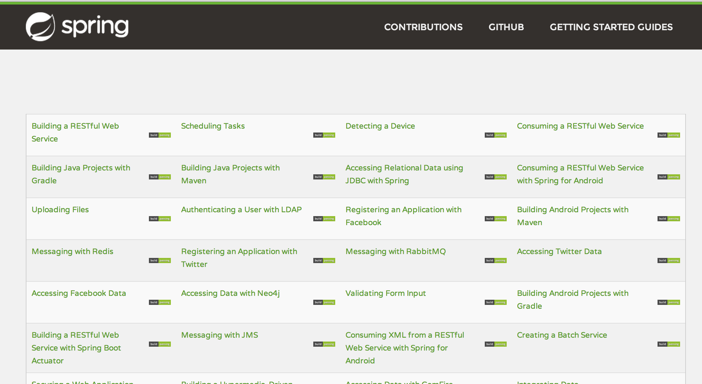

# Travis Aggregator [](https://travis-ci.org/spring-guides/drone-aggregator)

Running more than a handful of CI jobs at http://travis-ci.org? Their usage of screen real estate can leave you scrolling all the time when you really need a quick glance to see if everything is up.

travis-aggregator is a [Spring Boot](http://projects.spring.io/spring-boot/) application that uses [Jsoup](http://jsoup.org) to elegantly grab every [Getting Started Guide](http://spring.io/guides) and construct a slim and trim table with links to each guide as well as its corresponding Travis CI job.

> **NOTE:** See http://bit.ly/app-mgmt-tools-with-boot for a webinar that walks through this app.

[](http://bit.ly/app-mgmt-tools-with-boot)

## Getting Started

You first need to [install Spring Boot](http://docs.spring.io/spring-boot/docs/current/reference/htmlsingle/#getting-started-installing-the-cli). I won't show that here because the instructions behind that link are pretty detailed. I'll just assume you got things set up right.

## Run the application
Now you can run the application.

    spring run app.groovy
        
You should see something like this:

```

  .   ____          _            __ _ _
 /\\ / ___'_ __ _ _(_)_ __  __ _ \ \ \ \
( ( )\___ | '_ | '_| | '_ \/ _` | \ \ \ \
 \\/  ___)| |_)| | | | | || (_| |  ) ) ) )
  '  |____| .__|_| |_|_| |_\__, | / / / /
 =========|_|==============|___/=/_/_/_/
 :: Spring Boot ::            (v1.0.0.RC4)

2014-03-07 22:22:14.060  INFO 35955 --- [       runner-0] o.s.boot.SpringApplication               : Starting application on retina with PID 35955 (/Users/gturnquist/.m2/repository/org/springframework/boot/spring-boot/1.0.0.RC4/spring-boot-1.0.0.RC4.jar started by gturnquist)
2014-03-07 22:22:14.100  INFO 35955 --- [       runner-0] ationConfigEmbeddedWebApplicationContext : Refreshing org.springframework.boot.context.embedded.AnnotationConfigEmbeddedWebApplicationContext@4225f0fd: startup date [Fri Mar 07 22:22:14 CST 2014]; root of context hierarchy
2014-03-07 22:22:15.136  INFO 35955 --- [       runner-0] .t.TomcatEmbeddedServletContainerFactory : Server initialized with port: 8080
2014-03-07 22:22:15.452  INFO 35955 --- [       runner-0] o.apache.catalina.core.StandardService   : Starting service Tomcat
2014-03-07 22:22:15.452  INFO 35955 --- [       runner-0] org.apache.catalina.core.StandardEngine  : Starting Servlet Engine: Apache Tomcat/7.0.52
2014-03-07 22:22:15.559  INFO 35955 --- [ost-startStop-1] org.apache.catalina.loader.WebappLoader  : Unknown loader org.springframework.boot.cli.compiler.ExtendedGroovyClassLoader$DefaultScopeParentClassLoader@20dbbc62 class org.springframework.boot.cli.compiler.ExtendedGroovyClassLoader$DefaultScopeParentClassLoader
2014-03-07 22:22:15.566  INFO 35955 --- [ost-startStop-1] o.a.c.c.C.[Tomcat].[localhost].[/]       : Initializing Spring embedded WebApplicationContext
2014-03-07 22:22:15.566  INFO 35955 --- [ost-startStop-1] o.s.web.context.ContextLoader            : Root WebApplicationContext: initialization completed in 1469 ms
2014-03-07 22:22:16.008  INFO 35955 --- [ost-startStop-1] o.s.b.c.e.ServletRegistrationBean        : Mapping servlet: 'dispatcherServlet' to [/]
2014-03-07 22:22:16.010  INFO 35955 --- [ost-startStop-1] o.s.b.c.embedded.FilterRegistrationBean  : Mapping filter: 'hiddenHttpMethodFilter' to: [/*]
2014-03-07 22:22:18.630  INFO 35955 --- [       runner-0] o.s.w.s.handler.SimpleUrlHandlerMapping  : Mapped URL path [/**/favicon.ico] onto handler of type [class org.springframework.web.servlet.resource.ResourceHttpRequestHandler]
2014-03-07 22:22:18.713  INFO 35955 --- [       runner-0] s.w.s.m.m.a.RequestMappingHandlerMapping : Mapped "{[/],methods=[],params=[],headers=[],consumes=[],produces=[],custom=[]}" onto public java.lang.String io.spring.guide.travis.TravisAggregator.index(java.util.Map<java.lang.String, java.lang.Object>)
2014-03-07 22:22:18.755  INFO 35955 --- [       runner-0] o.s.w.s.handler.SimpleUrlHandlerMapping  : Mapped URL path [/**] onto handler of type [class org.springframework.web.servlet.resource.ResourceHttpRequestHandler]
2014-03-07 22:22:18.755  INFO 35955 --- [       runner-0] o.s.w.s.handler.SimpleUrlHandlerMapping  : Mapped URL path [/webjars/**] onto handler of type [class org.springframework.web.servlet.resource.ResourceHttpRequestHandler]
2014-03-07 22:22:18.945  INFO 35955 --- [       runner-0] o.s.j.e.a.AnnotationMBeanExporter        : Registering beans for JMX exposure on startup
2014-03-07 22:22:19.119  INFO 35955 --- [       runner-0] s.b.c.e.t.TomcatEmbeddedServletContainer : Tomcat started on port: 8080
2014-03-07 22:22:19.120  INFO 35955 --- [       runner-0] o.s.boot.SpringApplication               : Started application in 5.379 seconds (JVM running for 7.539)
```

You can now see the table of CI jobs at <http://localhost:8080>.



